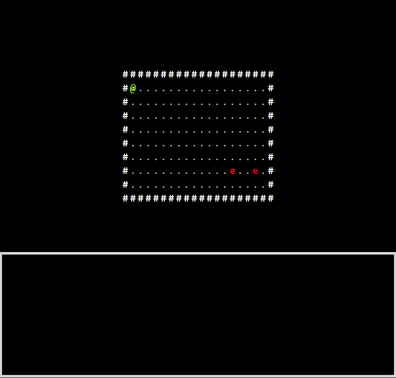

# Roguelike Game

This game was created using Vite + TypeScript + React + Redux. To run enter:

```
npm install
npm run dev
```

## About the Game:

This game is essentially a very simple ASCII-art [roguelike game](https://en.wikipedia.org/wiki/Roguelike). The game is played by pressing the arrow keys to navigate around the room. The player is denoted by the '@' character, and enemies are denoted by the 'e' character. The '.' character signifies an unoccupied tile, and the '#' character represents a solid wall. The game is turn based. 1 turn of the game elapses every time an arrow key is pressed. After the player moves, all enemies in the room will also move. If no keys are pressed nothing should happen. If the player is next to an enemy, and attempts to move in the direction of that enemy, the player will attack it (and not move). The enemy will then attack in return, but the player always attacks first.

The state of the entire game is represented in the redux store. The "map" is a 1 dimensional array containing all the characters that represent the game including the positions of the enemies and the player.

**Gameplay gif:**



# Details:

## 1: Level Component

The level component is in Level.jsx. This component is responsible for rendering the level for the player.

1. Map is retrieved from the redux store and display it as an html table.

2. The value of index should match the index of where that element appears in the map array.

3. If the character in a cell is the player ('@'), enemy ('e'), or a wall ('#') apply the corresponding css styling defined in index.css.

## 2: Step Reducer

The step action is dispatched every time an arrow key is pressed. A single "step" represents one complete turn in the game. The next state of the entire game is computeed after each step action is dispatched.

1. The player moves in the direction of the arrow key that was pressed

   - The player can move onto any adjacent '.' tile.
   - If the player cannot move in that direction, the rest of the turn still plays out.

2. All enemies move towards the player

   - A BFS algorithm is used for moving the enemies towards the player ([Breadth First Search](https://en.wikipedia.org/wiki/Breadth-first_search)).

3. Player attacks performed against enemies

   - The player attacks only the enemy they attempt to move towards.
   - The player can only attack an enemy who was occupying an adjacent tile when the turn began.
   - The enemies health should be reduced by an amount equal to the player's damage.
   - If an enemies health is 0 or less, remove the enemy from the game.

4. Enemy attacks against the player

   - Enemies adjacent to the player will attack.
   - If the player started a turn adjacent to an enemy and moves away, the player still gets attacked by that enemy.
   - Enemy attacks are always calculated **after** any player attacks.
   - The player's health should be reduced by an amount equal to the enemies damage.

## 3: Logger component

Feedback is provided to the player via Logger Component in Logger.jsx.

The Logger Component is in Logger.jsx. The Logger is the grey rectangle at the bottom of the screen. Because this game uses a very minimal graphical interface, the logger provides more feedback to the player. The purpose of the Logger is to display all the events that happen to the player in the form of text. The list grows downward and is contained within the rectangle.

1. When the player moves, the message "player moved x" where x is the direction the player moved in (north, east, south, west) is display.

   - If the player could not move in the direction of the arrow key of the dispatched step action, no message should display.

2. When a player attacks an enemy, the message "player attacked enemy" displays.

3. When an enemy attacks a player, the message "enemy attacked player" displays.

4. The Logger displays a maximum of 20 messages.

5. The scrollbar auto-scrolls to the bottom of the list of displayed messages.
